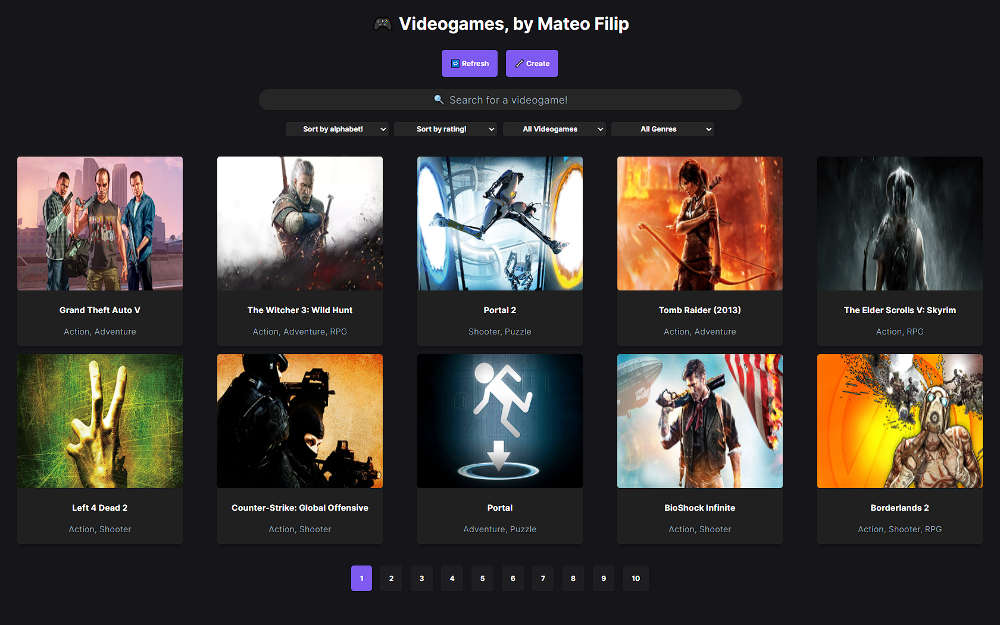

# 🎮 **Videogame App - Mateo Filip**


**Little project made as a evaluative instance at [Soy Henry](https://www.soyhenry.com/)'s web development bootcamp.**

**This Single Page Application lets you search videogames through the use of an external API with almost 700k videogames in it. You can ordenate brought videogames by alphabetical order, or by their rating; also, you can filter them either by one of their genres or by creation type - meaning, those brought by the API or created with the use of a controlled form.**

**The search bar lets you navigate between videogames in particular, and by clicking in one of them the user can take a look at a detail page where a ton more info than that in the cards gets displayed.**

## 💻 **Used Techonologies**

- **HTML5**
- **CSS3**
- **SASS**
- **JavaScript (ES6)**
- **React**
- **Redux**
- **Node.js**
- **Express.js**
- **SQL - PostgreSQL | Sequelize**

## 💻 **Installation**

```
🍂 git clone https://github.com/mateofilip/PI-VIDEOGAMES.git
🍂 npm install >> PI-VIDEOGAMES/api
🍂 npm start >> PI-VIDEOGAMES/api/
🍂 npm install >> PI-VIDEOGAMES/client/
🍂 npm start >> PI-VIDEOGAMES/client/
```

## 💻 **Preview**

<p>



</p>
<p>


</p>
